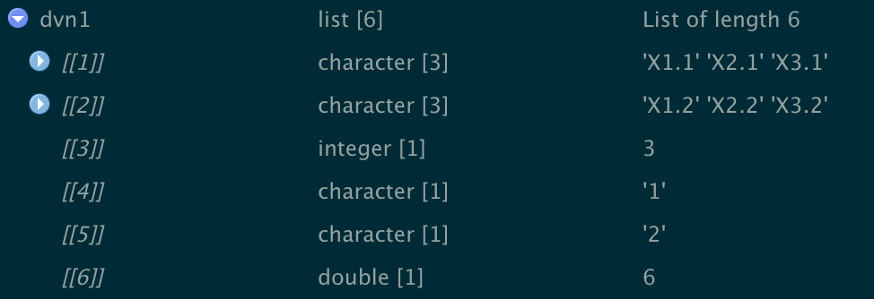
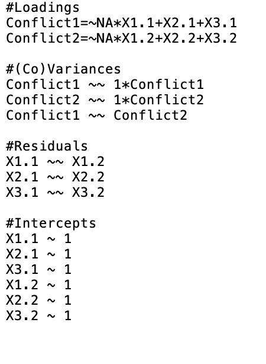
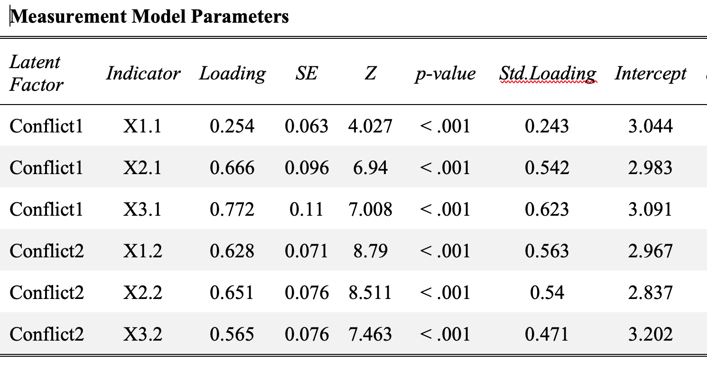
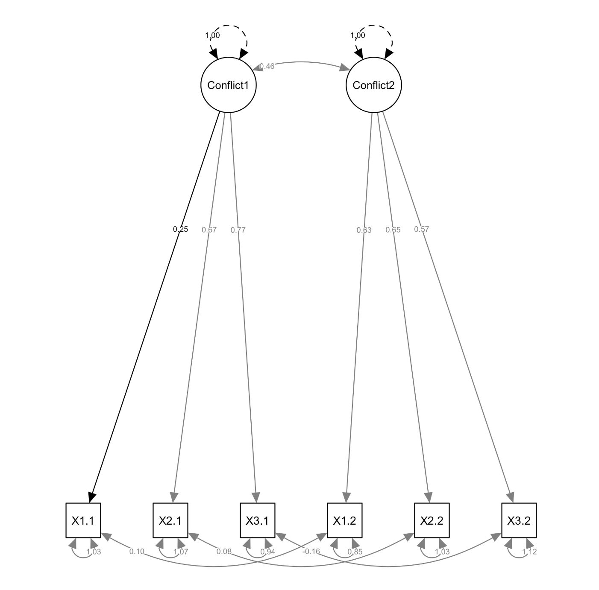
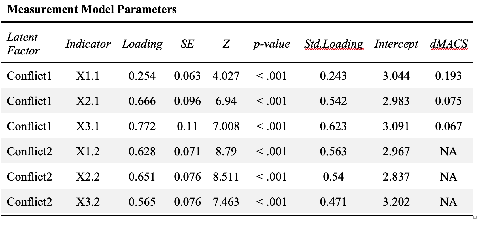

<!-- README.md is generated from README.Rmd. Please edit that file -->

```{r, include = FALSE}
knitr::opts_chunk$set(
  collapse = TRUE,
  comment = "#>",
  fig.path = "man/figures/README-",
  out.width = "100%"
)
```
# dySEM

<!-- badges: start -->
<!-- badges: end -->

The goal of dySEM is help automate the process of using lavaan() to fit latent dyadic data analysis models. Currently the package supports the fitting of dyadic measurement invariance models (including assessing magnitude of dyadic noninvariance), and latent Actor-Partner Interdependence Models (APIMs). Once fitted, automated output  includes tables and/or path diagrams. 

## Installation

You can install the development version from [GitHub](https://github.com/) with:

``` r
# install.packages("devtools")
devtools::install_github("jsakaluk/dySEM")
```
## Example

To use dySEM(), you will need to have a data set imported, that is in wide (or dyad) format (i.e., each row is a dyad, with separate columns for variables from Partner 1 and Partner 2). Currently, the package requires that your indicator variables for Factors X and Y follow some repetitious ***stem*** (e.g., "prqc" in "prqc1.1", "prqc1.2"), and that the same variable for different partners has a ***distinguishing character*** which indicates which variable is for which partner (e.g., the "1" or "2" in "prqc1.1", "prqc1.2"), which may (or may not) have a ***separator*** (e.g., the "." in "prqc1.1", "prqc1.2") in between the ***stem*** and ***distinguishing character***

The workflow of using dySEM() proceeds in four steps. 

1. Use the dyadVarNames() function to extract some information about your indicator variables for your latent variable(s). 
1. Use one of the script-writing functions (e.g., dyadCFA(), apimSEM()) to write the lavaan() script for your desired measurment and/or structural model. You will need to specify a few options, but most of the work is done using the outputted object from the previous step via dyadVarNames(). Your lavaan() script is both saved to your global environment and outputted to your working directory for reproducibility purposes. 
1. Use one of the lavaan() model fitting functions (e.g., cfa(), sem()) to fit the model specified by your chosen dySEM() script-writing function and save the output. 
1. Use dyOutput() to automatically export reproducible results in the form of tables and/or path diagrams to your current working directory.

### Preface: Example data

This example uses hypothetical dyadic data from 500 couples, containing three indicators of conflict (*X1*:*X3*) and three indicators of satisfaction (*Y1*:*Y3*) for each partner. As typical for SEM, the data are in "wide" format, where each row is a couple, and each partner's score on a particular variable (e.g., *X1*) is located in a separate column (e.g., *X1.1* and *X1.2*).

```{r data, warning=FALSE, message=FALSE}
library(dySEM)
library(lavaan)

data(dat)
head(dat)

```

### Step 1: Use dyadVarNames()

dyadVarNames() might seem like an underwhelming function, but it is the unsung hero of the package. As the user, you supply your data frame, and information about the stem(s) for your latent *X* and/or *Y* variable(s), delimiting character (if any), and distinguishing characters. dyadVarNames() will then save a list of qualities (of length 6 for one latent variable, or length 9 for two latent variables) about your items, which is then supplied to every subsequent function in the dySEM package, in order to facilitate script-writing and output automation. I refer to the saved dyadVarNames() object as a "dvn" from now on. 

```{r dvn, results="hide", warning=FALSE, message=FALSE}

#Specify the stem of variable names for indicators of latent factor x,the separator between stem 
#and the partner distinguisher for each partner, and the distinguishing 
#characters for partners. Save in object dvn1. 
dvn1 <- dyadVarNames(dat, xvar="X",  sep = ".",
                   distinguish1 = "1", distinguish2 = "2")
````

The resulting dvn1 object contains item names for each partner, 
the number of indicators for your latent X variable, the distinguishing characters, and the total number of variables: 



### Step 2: Use a script-writing function

dyadSEM() has multiple script writing functions (currently dyadic CFA models and latent APIMs are supported). Though there are some small differences, each generally works the same way: you supply a dvn, assign an (arbitrary) name(s) for your latent variable(s), and indicate which level of dyadic invariance you want specifed in the model. 

```{r dyadCFA(), results="hide", warning=FALSE, message=FALSE}
con.config.script = dyadCFA(dvn1, lvname = "Conflict",  model = "configural")
```

The output is a text object for a properly-specified dyadic CFA mode configural invariance, that you can immediately submit to lavaan(). However, the function also creates a "scripts" folder in your current directory, and saves a .txt file of the lavaan script there too. This can be helpful if you need to ammend the script manually for specifying a more nuanced model, or simply for reproducibility/transparency purposes (e.g., including in a preregistration, posting to OSF, etc.,). 



### Step 3: Use a lavaan() model-fitting function

The dySEM() package does not actually do any of the model fitting for you: it simply helps you with the inputs/outputs of the comprehensive lavaan() package. Therefore, this step merely involves you specifing the script dySEM() wrote for you as an argument in one of the lavaan() model-fitting functions. I strongly recommend you learn about lavaan's options, particularly for estimator selection and missing data treatment. 
***Importantly***, as dySEM() writes scripts that already have the required scale-setting/identification constraints made (or relaxed), you should disabled lavaan()'s tendency to fix a factor loading or latent variance to 1. 

If you want detailed output (in addition to/in lieu of dySEM() automated output), you can then use summary( ) on the fitted lavaan() object, with the usual optional arguments specified.

```{r lavaan, results="hide", warning=FALSE, message=FALSE}

#Use lavaan::cfa() to fit the model specified by dyadCFA(). Disable cfa()Scale-setting options, and request mean structure. 
con.fit.config <- cfa(con.config.script, data = dat, std.lv = F, auto.fix.first= F, meanstructure = T)

#Request summary output, including standardized estimates and fit indices. 
summary(con.fit.config, standardized = TRUE, fit.measures = T)
```

### Step 4: Use dyOutput() to create reproducible tables and figures

Any summary() of lavaan() output will produce more numbers than many journals/editors/reviewers will expect you to report. Thankfully, CFAs and dyadic models typically have fairly standardized expectations around what parameters/tests need to be reported. The dyOutput() function capitalizes on this predictability, by outputting tables of expected measurement and/or structural parameters, and a fairly typical latent path diagram; these are saved in a new "output" folder in your working directory, called "tables" and "figures", respectively. Users can specify whether their path diagram should contain unstandardized vs. standardized estimates, or simply parameter labels (e.g., l1 for the first loading) 


```{r dyOutput(), results="hide", warning=FALSE, message=FALSE}

dyOutput(dvn1, con.fit.config, figtype = "unstandardized")

```




### Optional/recommended Step: Use dydMACS() estimate magnitude of noninvariance

Whenever you are testing dyadic invariance, you should also use the dydMACS() function to estimate the magnitude of the noninvariance for any given indicator (see Nye & Drasgow, 2012). The saved results can then be later passed (optionally) to dyOutput() if you wish to include the dMACS measure in your table of measurement parameters. All you need to do is supply the function with a fitted dyad configural invariance model. 

```{r dydMACS(), results="hide", warning=FALSE, message=FALSE}

con.dmacs = dydMACS(con.fit.config)

dyOutput(dvn1, con.fit.config, figtype = "unstandardized",dydMACS.x = con.dmacs)

```


