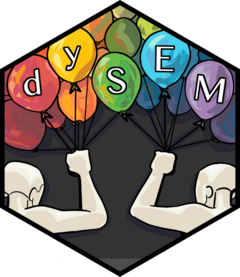

<!-- README.md is generated from README.Rmd. Please edit that file -->

# dySEM <a href="https://jsakaluk.github.io/dySEM/"></a>

<!-- badges: start -->

[](https://lifecycle.r-lib.org/articles/stages.html)
<!--](https://CRAN.R-project.org/package=dySEM)-->
[](https://github.com/jsakaluk/dySEM/actions/workflows/R-CMD-check.yaml)
[](https://app.codecov.io/gh/jsakaluk/dySEM)
[](https://www.codefactor.io/repository/github/jsakaluk/dysem/overview/master)
<!---->
<!-- badges: end -->

## Summary

The `dySEM` helps automate the process of scripting, fitting, and
reporting on latent models of dyadic data via
[`lavaan`](https://lavaan.ugent.be). The package was developed and used
in the course of the research described in [Sakaluk, Fisher, &
Kilshaw](https://psycnet.apa.org/record/2021-23304-001) (2021).

The `dySEM` logo was designed by Lowell Deranleau (for logo design
inquiries, email: <agangofwolves@gmail.com>).

## Installation

You can install the released version of dySEM from
[CRAN](https://cran.r-project.org) with:

``` r
install.packages("dySEM")
```

You can install the development version from
[GitHub](https://github.com/) with:

``` r
# install.packages("devtools")
devtools::install_github("jsakaluk/dySEM")
```

## Current Functionality

The package currently provides functionality regarding the following
types of latent dyadic data models:

1.  **Dyadic Confirmatory Factor Analysis**
2.  **Latent Actor-Partner Interdependence Models (APIM)**
3.  **Latent Common Fate Models (CFM)**
4.  **Latent Bifactor Dyadic (Bi-Dy) Models**
5.  **Observed Actor-Partner Interdependence (APIM)**

Additional features currently include:

- Automated specification of invariance constraints for any model,
  including full indistinguishability
- Functions to assist with the specification of **I-SAT Models** and
  **I-NULL Models** for calibrated model fit indexes with
  indistinguishable dyad models
- Functions to assist with reproducible creation of path diagrams and
  tables of statistical output
- Functions to calculate supplemental statistical information (e.g.,
  omega reliability, noninvariance effect sizes, corrected model fit
  indexes)

## Future Functionality

Functionality targeted for future development of `dySEM` is tracked
[here](https://github.com/jsakaluk/dySEM/projects/1). Current
high-priority items include:

1.  Longitudinal dyadic model scripting functions (e.g., curve of
    factors, common fate growth)
2.  Latent dyadic response surface analysis scripting and visualization
    functions
3.  Multi-group dyadic model scripting (e.g., comparing models from
    samples of heterosexual vs. LGBTQ+ dyads)
4.  Covariate scripting and optionality
5.  Improved ease of item selection in scraper functions

## Collaboration

Please submit any feature requests via the `dySEM`
[issues](https://github.com/jsakaluk/dySEM/issues) page, using the
“Wishlist for dySEM Package Development” tag.

If you are interested in collaborating on the development of `dySEM`,
please contact Dr. Sakaluk.

## dySEM Workflow

A `dySEM` workflow typically involves five steps, which are covered
in-depth in the [Overview
vignette](https://jsakaluk.github.io/dySEM/articles/dySEM.html).
Briefly, these steps include:

1.  Import and wrangle **data**
2.  **Scrape** variables from your data frame
3.  **Script** your preferred model
4.  **Fit** and **Inspect** your model via `lavaan`
5.  **Output** statistical visualizations and/or tables

There are additional optional functions, as well, that help users to
calculate certain additional quantitative values (e.g., reliability,
corrected model fit indexes in models with indistinguishable dyad
members).

### 1. Import and wrangle **data**

Structural equation modeling (SEM) programs like `lavaan` require dyadic
data to be in dyad structure data set, whereby each row contains the
data for one dyad, with separate columns for each observation made for
each member of the dyad. For example:

``` r
DRES
#> # A tibble: 121 × 18
#>    PRQC_1.1 PRQC_2.1 PRQC_3.1 PRQC_4.1 PRQC_5.1 PRQC_6.1 PRQC_7.1 PRQC_8.1
#>       <int>    <int>    <int>    <int>    <int>    <int>    <int>    <int>
#>  1        7        7        7        7        7        7        7        5
#>  2        6        6        6        7        7        6        5        5
#>  3        7        7        7        7        7        7        7        6
#>  4        6        6        6        7        7        6        5        6
#>  5        7        7        7        7        7        6        7        6
#>  6        6        6        6        6        6        3        6        5
#>  7        7        6        7        6        6        6        5        6
#>  8        6        7        7        7        7        6        5        6
#>  9        7        7        7        7        7        6        6        6
#> 10        6        6        6        7        7        7        4        4
#> # ℹ 111 more rows
#> # ℹ 10 more variables: PRQC_9.1 <int>, PRQC_1.2 <int>, PRQC_2.2 <int>,
#> #   PRQC_3.2 <int>, PRQC_4.2 <int>, PRQC_5.2 <int>, PRQC_6.2 <int>,
#> #   PRQC_7.2 <int>, PRQC_8.2 <int>, PRQC_9.2 <int>
```

### 2. **Scrape** variables from your data frame

The `dySEM` scrapers consider appropriately repetitiously named
indicators as consisting of at least three distinct elements: stem,
item, and partner. **Delimiter** characters (e.g., “.”, “\_“) are
commonly–but not always–used to separate some/all of these
elements.`dySEM` scrapers largely function by asking you to specify in
what order the elements of variable names are ordered.

``` r
dvn <- scrapeVarCross(DRES, x_order = "sip", x_stem = "PRQC", x_delim1="_",x_delim2=".",  distinguish_1="1", distinguish_2="2")
```

### 3. **Script** your preferred model

*Scripter* functions like
[`scriptCFA`](https://github.com/jsakaluk/dySEM/blob/master/R/scriptCFA.R)
typically require only three arguments to be specified:

1.  the `dvn` object (e.g., from `scrapeVarCross`) to be used to script
    the model 1.arbitrary name(s) for the latent variable(s) you are
    modeling
2.  the kind of parameter equality constraints that you wish to be
    imposed (if any)

``` r
qual.indist.script <- scriptCFA(dvn, lvname = "Quality")
```

This function returns a character object with `lavaan` compliant syntax
for your chosen model, as well as exporting a reproducible .txt of the
scripted model to a /scripts folder in your working directory.

### 4. **Fit** and **Inspect** your model via `lavaan`

You can immediately pass any script(s) returned from a `dySEM` scripter
to your preferred `lavaan` wrapper, with your estimator and missing data
treatment of choice. For example:

``` r
qual.indist.fit <- lavaan::cfa(qual.indist.script, data = DRES, std.lv = FALSE, auto.fix.first= FALSE, meanstructure = TRUE)
```

At this point, the full arsenal of `lavaan` model-inspecting tools are
at your disposal. For example:

``` r
summary(qual.indist.fit, fit.measures = TRUE, standardized = TRUE, rsquare = TRUE)
```

### 5. **Output** statistical visualizations and/or tables

`dySEM` also contains functionality to help you quickly, correctly, and
reproducibly generate output from your fitted model(s), in the forms of
path diagrams and/or tables of statistical values. By default these save
to a temporary directory, but you can specify a directory of your choice
by replacing `tempdir()` (e.g., with `"."`, which will place it in your
current working directory).

``` r
outputModel(dvn, model = "cfa", fit = qual.indist.fit, 
            table = TRUE, tabletype = "measurement", 
            figure = TRUE, figtype = "unstandardized",
            writeTo = tempdir(),
            fileName = "dCFA_indist")
```

## Code of Conduct

Please note that the dySEM project is released with a [Contributor Code
of Conduct](https://jsakaluk.github.io/dySEM/CODE_OF_CONDUCT.html). By
contributing to this project, you agree to abide by its terms.
