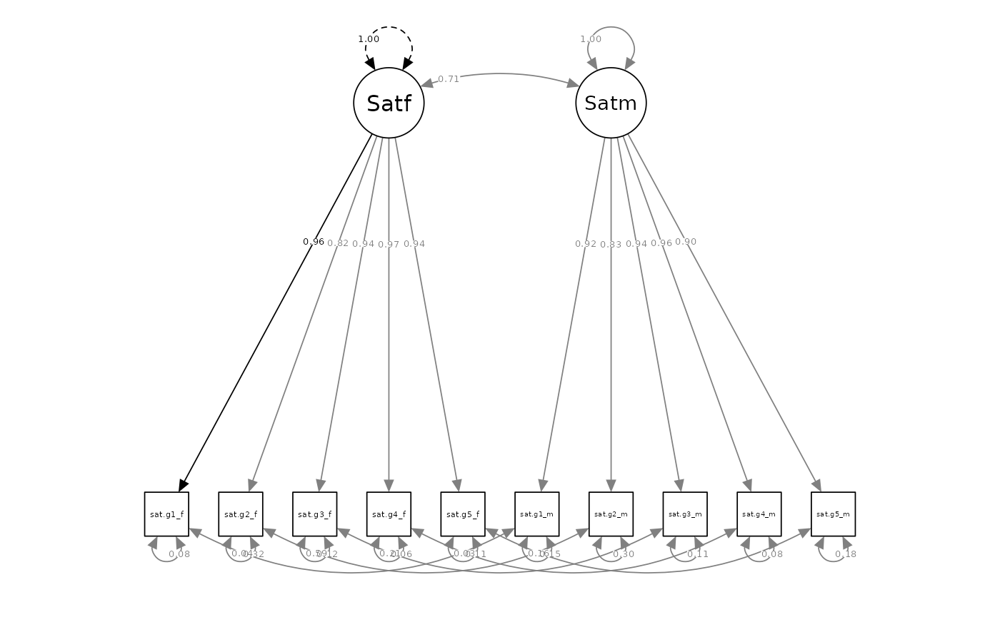

# Fitting and Interpreting the Correlated Dyadic Factors Model (CDFM)

## Fair Use of this Tutorial

This tutorial is a supplemental material from the following article:

Sakaluk, J. K., & Camanto, O. J. (2025). *Dyadic Data Analysis via
Structural Equation Modeling with Latent Variables: A Tutorial with the
dySEM package for R*.

This article is intended to serve as the primary citation of record for
the `dySEM` package’s functionality for the techniques described in this
tutorial. **If this tutorial has informed your modeling strategy
(including but not limited to your use of `dySEM`), please cite this
article**.

The citation of research software aiding in analyses—like the use of
`dySEM`—is a required practice, according to the **Journal Article
Reporting Standards (JARS) for Quantitative Research in Psychology**
([Appelbaum et al.,
2018](https://psycnet.apa.org/fulltext/2018-00750-002.html)).

Furthermore, citations remain essential for our development team to
demonstrate the impact of our work to our local institutions and our
funding sources, and with your support, we will be able to continue
justifying our time and efforts spent improving `dySEM` and expanding
its reach.

## Overview

The CDFM is a **“uni-construct”** dyadic SEM (i.e., used to represent
dyadic data about one—and only one—construct, like “relationship
satisfaction”).

It contains:

- two latent variables/factors, onto which
- each partner’s observed variables discriminantly load (i.e., one
  partner’s observed variables onto their factor, and the other
  partner’s observed variables onto their factor)

It also features two varieties of covariances (or correlations,
depending on scale-setting/output standardization):

- one between the two latent variables (effectively, the latent
  intraclass correlation coefficient \[ICC\]), and
- several between the residual variances of the same observed variables
  across each partner (e.g., between Item 1 for Partner A and Partner B;
  another between Item 2 for Partner A and Partner B, etc.,).

Owing to it serving as one half of the measurement model of a [latent
actor-partner interdependence model
(APIM)](https://jsakaluk.github.io/dySEM/articles/L-APIM.html)—and the
APIM being the clear default structural model in relationship science
([Kenny, 2018](https://doi.org/10.1111/pere.12240))—the CDFM could
(tacitly) be considered relationship science’s “default”—for better and
for worse—uni-construct dyadic SEM.

## Packages, Data, and `dySEM` Overview

This exemplar makes use of the `tidyverse` meta-package, and the `gt`,
`dySEM`, and `lavaan` (Rosseel, 2012) packages.

``` r
library(dplyr) #for data management
library(gt) #for reproducible tabling
library(dySEM) #for dyadic SEM scripting and outputting
library(lavaan) #for fitting dyadic SEMs
```

For the exemplar, we will use the built-in
[`commitmentM`](https://jsakaluk.github.io/dySEM/reference/commitmentM.html)
dataset from `dySEM`, which includes ratings of satisfaction and
commitment from 282 mixed-sex dyads. These data were collected using the
“global” version of items for relationship satisfaction from the Rusbult
et al. (1998) *Investment Model Scale*. More information about this data
set can be found in [Sakaluk et
al. (2021)](https://doi.org/10.1111/pere.12341).

This dataset already possesses many of the desirable features of a
dataset for use with `dySEM`, as it is in wide format, and the variable
names have a repetitive predictable structure (to learn more, see [our
tutorial on variable name
structure](https://jsakaluk.github.io/dySEM/articles/varnames.html)).
Specifically:

- The *satisfaction* items follow a “sip” pattern (Stem, Item, Partner)
  with a stem of “sat.g”, followed immediately by a number for the item
  (i.e., no delimiter between these elements), followed by a delimiting
  “\_”, and then either the character “f” or “m” to indicate to which
  partner the item refers. For example, the first satisfaction item for
  partner 1 is “sat.g1_f”, and the first satisfaction item for partner 2
  is “sat.g1_m”.

- Likewise, the *commitment* items follow a similar “sip” pattern,
  albeit with a different stem, “com”.

For this exemplar of dyadic invariance testing, we will focus on the
satisfaction items, and assign them into a stand-alone demonstration
data frame called `my_dat`:

``` r

my_dat <- commitmentM

#show satisfaction item previews
my_dat |> 
  select(starts_with("sat.g")) |> 
  as_tibble() 
#> # A tibble: 282 × 10
#>    sat.g1_f sat.g2_f sat.g3_f sat.g4_f sat.g5_f sat.g1_m sat.g2_m sat.g3_m
#>       <int>    <int>    <int>    <int>    <int>    <int>    <int>    <int>
#>  1        2        1        1        2        1        1        1        1
#>  2        9        9        9        9        9        9        9        9
#>  3        6        5        7        5        7        5        5        4
#>  4        9        5        9        9        9        2        5        4
#>  5        1        7        1        2        2        2        5        1
#>  6        8        8        8        8        8        9        9        9
#>  7        9        9        9        9        9        9        9        9
#>  8        1        1        1        1        1        1        1        1
#>  9        6        5        4        6        6        9        2        7
#> 10        9        9        9        9        9        9        9        9
#> # ℹ 272 more rows
#> # ℹ 2 more variables: sat.g4_m <int>, sat.g5_m <int>
```

As described in the paper, and the [Get Started tutorial for
`dySEM`](https://jsakaluk.github.io/dySEM/articles/dySEM.html) , the
steps we must take to carry out dyadic invariance testing with `dySEM`
are:

1.  **Scrape** the relevant items from the data set, to be included in
    each CDFM
2.  **Script** the `lavaan` syntax for the dyadic configural, loading,
    intercept, and residual invariance models
3.  **Fit** the invariance models with `lavaan`
4.  generate reproducible **output** of our analyses, and
5.  consider the use of **optional** functionality for supplementary
    indexes and tests that `dySEM` can compute (we will demonstrate a
    couple)

## 1. *Scrape* the Variables

The
[`scrapeVarCross()`](https://jsakaluk.github.io/dySEM/reference/scrapeVarCross.html)
from `dySEM` is the appropriate function to scrape the variable
information needed for automating the scripting of latent dyadic models
of cross-sectional data. In this instance, we are only scraping
information about indicators about one (pair of) dyadic latent
variable(s): men and women’s latent relationship satisfaction.

As described before, the *satisfaction* items follow a [“sip” pattern
(Stem, Item,
Partner)](https://jsakaluk.github.io/dySEM/articles/varnames.html) with
a stem of “sat.g”, followed immediately by a number for the item (i.e.,
no delimiter between these elements), followed by a delimiting “\_”, and
then either the character “f” or “m” to indicate to which partner the
item refers.

We therefore refer to our data frame (“`my_dat`”) for the `dat`
argument, and the pattern, stem, delimiters (if any), and distinguishing
characters for the `x_order`, `x_stem`, `x_delim1`, `x_delim2`,
`distinguish_1`, and `distinguish_2` arguments, respectively. In this
instance, our stem is “sat.g”; there is no first delimiter, and an “\_”
for the second delimiter; and the distinguishing characters are “f” and
“m”.

We assign the output of this function (a list of variable names an
information) to an object we are (arbitrarily) calling “sat_dvn”; *we
often refer to this list as a* **“dyad variable names”** *list, or*
**“dvn”** *for short*.

``` r

sat_dvn <- scrapeVarCross(dat = my_dat, x_order = "sip", x_stem = "sat.g", x_delim1 = "", x_delim2="_", distinguish_1="f", distinguish_2="m")
#> 
#> ── Variable Scraping Summary ──
#> 
#> ✔ Successfully scraped 1 latent variable: sat.g
#> ℹ sat.g: 5 indicators for P1 (f), 5 indicators for P2 (m)
#> ℹ Total indicators: 10

sat_dvn
#> $p1xvarnames
#> [1] "sat.g1_f" "sat.g2_f" "sat.g3_f" "sat.g4_f" "sat.g5_f"
#> 
#> $p2xvarnames
#> [1] "sat.g1_m" "sat.g2_m" "sat.g3_m" "sat.g4_m" "sat.g5_m"
#> 
#> $xindper
#> [1] 5
#> 
#> $dist1
#> [1] "f"
#> 
#> $dist2
#> [1] "m"
#> 
#> $indnum
#> [1] 10
```

As can be seen, the information contained in the dvn is rather mundane:
the indicator names for the “f” partners (e.g., “sat.g1_f”), the
indicator names for the “m” partners (e.g., “sat.g5_m”), the number of
indicators per partner (in this case, 5), the distinguishing characters
(“f” and “m”), and the total number of indicators (10) in the entire
set. Yet this information is all that is needed for `dySEM` to
dramatically simplify the process of scripting dyadic SEM models,
including dyadic invariance models.

## 2. *Script* the Model(s)

Next, we will script the dyadic configural, loading, intercept, and
residual invariance models. We will use the
[`scriptCor()`](https://jsakaluk.github.io/dySEM/reference/scriptCor.html)
function from `dySEM` to do this. This function requires the `dvn`
object we created in the prior step, an arbitrary name for the latent
variable for `lavaan`, and the `constr_dy_meas` and `constr_dy_struct`
arguments to indicate which measurement (i.e., “meas”) and structural
(i.e., “struct”) parameters we want to constraint (i.e., “constr”)
across dyad members (i.e., “dy”). The `scaleset` argument automatically
defaults to the fixed-factor scale-setting and identification method,
preferred for invariance testing . However, we encourage users who are
just beginning to include this argument explicitly, so they (and others)
can readily determine their model specification approach.

Below, we script the sequence of four models to be fit and compared; we
forego the use of the `writeTo` and `fileName` arguments, which are used
to save the `.txt` of scripts to a file. Finally, we use an intuitive
naming structure to keep track of which model script resides in which R
object.

``` r

sat.config.script <- scriptCor(sat_dvn, lvname = "Sat", scaleset = "FF", constr_dy_meas = "none", constr_dy_struct = "none")

sat.load.script <- scriptCor(sat_dvn, lvname = "Sat", scaleset = "FF", constr_dy_meas = c("loadings"), constr_dy_struct = "none")

sat.int.script <- scriptCor(sat_dvn, lvname = "Sat", scaleset = "FF", constr_dy_meas = c("loadings", "intercepts"), constr_dy_struct = "none")

sat.resid.script <- scriptCor(sat_dvn, lvname = "Sat", scaleset = "FF", constr_dy_meas = c("loadings", "intercepts", "residuals"), constr_dy_struct = "none")
```

In their stored form, these scripts are not particularly readable, but
as we shall soon see, they are immediately passable to `lavaan`:

``` r

sat.resid.script
#> [1] "#Measurement Model\n\n#Loadings\nSatf=~NA*sat.g1_f+lx1*sat.g1_f+lx2*sat.g2_f+lx3*sat.g3_f+lx4*sat.g4_f+lx5*sat.g5_f\nSatm=~NA*sat.g1_m+lx1*sat.g1_m+lx2*sat.g2_m+lx3*sat.g3_m+lx4*sat.g4_m+lx5*sat.g5_m\n\n#Intercepts\nsat.g1_f ~ tx1*1\nsat.g2_f ~ tx2*1\nsat.g3_f ~ tx3*1\nsat.g4_f ~ tx4*1\nsat.g5_f ~ tx5*1\n\nsat.g1_m ~ tx1*1\nsat.g2_m ~ tx2*1\nsat.g3_m ~ tx3*1\nsat.g4_m ~ tx4*1\nsat.g5_m ~ tx5*1\n\n#Residual Variances\nsat.g1_f ~~ thx1*sat.g1_f\nsat.g2_f ~~ thx2*sat.g2_f\nsat.g3_f ~~ thx3*sat.g3_f\nsat.g4_f ~~ thx4*sat.g4_f\nsat.g5_f ~~ thx5*sat.g5_f\n\nsat.g1_m ~~ thx1*sat.g1_m\nsat.g2_m ~~ thx2*sat.g2_m\nsat.g3_m ~~ thx3*sat.g3_m\nsat.g4_m ~~ thx4*sat.g4_m\nsat.g5_m ~~ thx5*sat.g5_m\n\n#Residual Covariances\nsat.g1_f ~~ sat.g1_m\nsat.g2_f ~~ sat.g2_m\nsat.g3_f ~~ sat.g3_m\nsat.g4_f ~~ sat.g4_m\nsat.g5_f ~~ sat.g5_m\n\n#Structural Model\n\n#Latent (Co)Variances\nSatf ~~ 1*Satf\nSatm ~~ NA*Satm\nSatf ~~ Satm\n\n#Latent Means\nSatf ~ 0*1\nSatm ~ NA*1"
```

However, when exported (via the `writeTo` and `fileName` arguments) or
concatenated, they can be presented in a much more readable format that
mirrors what users expect from a manually written `lavaan` script:

``` r

cat(sat.resid.script)
#> #Measurement Model
#> 
#> #Loadings
#> Satf=~NA*sat.g1_f+lx1*sat.g1_f+lx2*sat.g2_f+lx3*sat.g3_f+lx4*sat.g4_f+lx5*sat.g5_f
#> Satm=~NA*sat.g1_m+lx1*sat.g1_m+lx2*sat.g2_m+lx3*sat.g3_m+lx4*sat.g4_m+lx5*sat.g5_m
#> 
#> #Intercepts
#> sat.g1_f ~ tx1*1
#> sat.g2_f ~ tx2*1
#> sat.g3_f ~ tx3*1
#> sat.g4_f ~ tx4*1
#> sat.g5_f ~ tx5*1
#> 
#> sat.g1_m ~ tx1*1
#> sat.g2_m ~ tx2*1
#> sat.g3_m ~ tx3*1
#> sat.g4_m ~ tx4*1
#> sat.g5_m ~ tx5*1
#> 
#> #Residual Variances
#> sat.g1_f ~~ thx1*sat.g1_f
#> sat.g2_f ~~ thx2*sat.g2_f
#> sat.g3_f ~~ thx3*sat.g3_f
#> sat.g4_f ~~ thx4*sat.g4_f
#> sat.g5_f ~~ thx5*sat.g5_f
#> 
#> sat.g1_m ~~ thx1*sat.g1_m
#> sat.g2_m ~~ thx2*sat.g2_m
#> sat.g3_m ~~ thx3*sat.g3_m
#> sat.g4_m ~~ thx4*sat.g4_m
#> sat.g5_m ~~ thx5*sat.g5_m
#> 
#> #Residual Covariances
#> sat.g1_f ~~ sat.g1_m
#> sat.g2_f ~~ sat.g2_m
#> sat.g3_f ~~ sat.g3_m
#> sat.g4_f ~~ sat.g4_m
#> sat.g5_f ~~ sat.g5_m
#> 
#> #Structural Model
#> 
#> #Latent (Co)Variances
#> Satf ~~ 1*Satf
#> Satm ~~ NA*Satm
#> Satf ~~ Satm
#> 
#> #Latent Means
#> Satf ~ 0*1
#> Satm ~ NA*1
```

## 3. *Fit* the Model(s)

All of these models can now be fit with whichever `lavaan` wrapper the
user prefers, and with their chosen analytic options (e.g., estimator,
missing data treatment, etc); our demonstration uses default
specifications for [`cfa()`](https://rdrr.io/pkg/lavaan/man/cfa.html):

``` r

sat.config.mod <- cfa(sat.config.script, data = my_dat)

sat.load.mod <- cfa(sat.load.script, data = my_dat)

sat.int.mod <- cfa(sat.int.script, data = my_dat)

sat.resid.mod <- cfa(sat.resid.script, data = my_dat)
```

## 4. *Output* and Interpret the Model(s)

Users could then inspect these models and compare these models using
their preferred strategy(ies), such as likelihood ratio test, and/or
changes in certain fit measures and/or information criteria. Given the
analytic researcher degrees of freedom and traditions of preference
herein, we leave it to researchers to apply (and preferably also
preregister) their preferred approach.

For example, researchers could use the built in anova() function as
below:

``` r

anova(sat.config.mod, sat.load.mod, sat.int.mod, sat.resid.mod)
#> 
#> Chi-Squared Difference Test
#> 
#>                Df    AIC    BIC   Chisq Chisq diff    RMSEA Df diff Pr(>Chisq)
#> sat.config.mod 29 8205.7 8336.0  57.490                                       
#> sat.load.mod   33 8204.1 8320.0  63.944      6.454 0.047147       4     0.1677
#> sat.int.mod    37 8199.2 8300.6  67.018      3.074 0.000000       4     0.5455
#> sat.resid.mod  42 8232.0 8315.3 109.846     42.828 0.165565       5  4.004e-08
#>                   
#> sat.config.mod    
#> sat.load.mod      
#> sat.int.mod       
#> sat.resid.mod  ***
#> ---
#> Signif. codes:  0 '***' 0.001 '**' 0.01 '*' 0.05 '.' 0.1 ' ' 1
```

Conversely, they could instead consider the use of
[`outputInvarCompTab()`](https://jsakaluk.github.io/dySEM/reference/outputInvarCompTab.html),
a function we have written to wrap some of the same comparative output
in a more reproducible-reporting-friendly format:

``` r

mods <- list(sat.config.mod, sat.load.mod, sat.int.mod, sat.resid.mod)

outputInvarCompTab(mods)
#> # A tibble: 4 × 15
#>   mod       chisq    df pvalue   aic   bic rmsea   cfi chisq_diff df_diff p_diff
#>   <chr>     <dbl> <dbl>  <dbl> <dbl> <dbl> <dbl> <dbl>      <dbl>   <dbl>  <dbl>
#> 1 configur…  57.5    29  0.001 8206. 8336. 0.06  0.993      NA         NA NA    
#> 2 loading    63.9    33  0.001 8204. 8320. 0.058 0.992       6.45       4  0.168
#> 3 intercept  67.0    37  0.002 8199. 8301. 0.054 0.992       3.07       4  0.545
#> 4 residual  110.     42  0     8232. 8315. 0.077 0.983      42.8        5  0    
#> # ℹ 4 more variables: aic_diff <dbl>, bic_diff <dbl>, rmsea_diff <dbl>,
#> #   cfi_diff <dbl>
```

Without additional argumentation,
[`outputInvarCompTab()`](https://jsakaluk.github.io/dySEM/reference/outputInvarCompTab.md)
(and other outputters in `dySEM`) return data frames; these are the most
flexible output types to supply to other tabling and/or visualization
functionality. However, users looking for a more expedient way to “clean
up” reporting from outputters can either make use of the `gtTab`
argument; `TRUE` will return a basic `gt` table which can then be
further modified using additional `gt` layers. This is a good option for
reproducible reporting document formats (like .Rmd and .Qmd):

``` r

outputInvarCompTab(mods, gtTab = TRUE)
```

| mod        | chisq   | df  | pvalue | aic      | bic      | rmsea | cfi   | chisq_diff | df_diff | p_diff | aic_diff | bic_diff | rmsea_diff | cfi_diff |
|------------|---------|-----|--------|----------|----------|-------|-------|------------|---------|--------|----------|----------|------------|----------|
| configural | 57.490  | 29  | 0.001  | 8205.656 | 8335.991 | 0.060 | 0.993 | NA         | NA      | NA     | NA       | NA       | NA         | NA       |
| loading    | 63.944  | 33  | 0.001  | 8204.110 | 8319.963 | 0.058 | 0.992 | 6.454      | 4       | 0.168  | -1.546   | -16.028  | -0.001     | -0.001   |
| intercept  | 67.018  | 37  | 0.002  | 8199.185 | 8300.556 | 0.054 | 0.992 | 3.074      | 4       | 0.545  | -4.926   | -19.407  | -0.004     | 0.000    |
| residual   | 109.846 | 42  | 0.000  | 8232.013 | 8315.282 | 0.077 | 0.983 | 42.828     | 5       | 0.000  | 32.828   | 14.726   | 0.022      | -0.010   |

Conversely, if users prefer to export the output to a file, they can set
the additional `writeTo` argument to a directory path (a path of “.”
will write to the user’s current working directory, like that associated
with an .Rproj file), and the `fileName` argument to a desired base name
for the output file. This will save the output as an `.rtf` file in that
directory, which can then be opened in Microsoft Word or other word
processing software:

``` r

outputInvarCompTab(mods, gtTab = TRUE, writeTo = ".", fileName = "sat_invar_comp")
```

Were one strictly to follow only the likelihood ratio test statistic as
a guide, they might feel comfortable claiming they have reasonable
support for most forms of dyadic invariance, with the exception of
significant residual noninvariances, $\chi^{2}$ (5) = 42.83, *p* = 0.

Users can then request that `dySEM` provide them with reproducible
output via either the
[`outputParamTab()`](https://jsakaluk.github.io/dySEM/reference/outputParamTab.html)
(for tabular output) or the
[`outputParamFig()`](https://jsakaluk.github.io/dySEM/reference/outputParamFig.html)
(for a path diagram, back-ended by `semPlot`). For example, if one
wanted a table of measurement model output from the dyadic intercept
invariance model they could use:

``` r

outputParamTab(sat_dvn, model = "cfa", fit = sat.int.mod, 
               tabletype = "measurement") |> 
  gt()
```

| Latent Factor | Indicator | Loading | SE    | Z      | p-value | Std. Loading | Intercept |
|---------------|-----------|---------|-------|--------|---------|--------------|-----------|
| Satf          | sat.g1_f  | 1.946   | 0.088 | 22.057 | \< .001 | 0.960        | 7.456     |
| Satf          | sat.g2_f  | 1.746   | 0.093 | 18.691 | \< .001 | 0.824        | 7.194     |
| Satf          | sat.g3_f  | 2.090   | 0.097 | 21.644 | \< .001 | 0.941        | 7.031     |
| Satf          | sat.g4_f  | 1.994   | 0.089 | 22.384 | \< .001 | 0.967        | 7.469     |
| Satf          | sat.g5_f  | 2.068   | 0.096 | 21.491 | \< .001 | 0.942        | 7.216     |
| Satm          | sat.g1_m  | 1.946   | 0.088 | 22.057 | \< .001 | 0.920        | 7.456     |
| Satm          | sat.g2_m  | 1.746   | 0.093 | 18.691 | \< .001 | 0.834        | 7.194     |
| Satm          | sat.g3_m  | 2.090   | 0.097 | 21.644 | \< .001 | 0.941        | 7.031     |
| Satm          | sat.g4_m  | 1.994   | 0.089 | 22.384 | \< .001 | 0.961        | 7.469     |
| Satm          | sat.g5_m  | 2.068   | 0.096 | 21.491 | \< .001 | 0.903        | 7.216     |

The `model` and `tabletype` arguments are the main providers of
optionality to be aware of, as
[`outputParamTab()`](https://jsakaluk.github.io/dySEM/reference/outputParamTab.md)
is also used to provide tabular output from other model types (e.g.,
APIMs), and users may be most interested in the output from one portion
of the model (e.g., the measurement model) versus another (e.g., the
structural model).

Path diagrams, meanwhile, are created with the
[`outputParamFig()`](https://jsakaluk.github.io/dySEM/reference/outputParamFig.md)
function, which is used in a similar manner to
[`outputParamTab()`](https://jsakaluk.github.io/dySEM/reference/outputParamTab.md)
(and includes the same `writeTo` and `fileName` arguments if you wish to
export a `.png`). Otherwise, the primary argument to be aware of is
`figtype`, which allows users to specify what kind of parameter
estimates they wish to be depicted in the path diagram.

``` r

outputParamFig(fit = sat.int.mod, figtype = "standardized")
```



Thus, in little more than a dozen lines of code, researchers can script,
fit, compare, and output a series of dyadic invariance comparisons using
the Correlated Dyadic Factors Model. From this, researchers would learn
that the satisfaction measure demonstrates reasonable configural,
loading, and intercept invariance between partners, and that the latent
ICC between partner’s satisfaction levels is 0.71, *z* = 16.15, *p*
\<.001 (95% CI: 0.62, 0.8).

## 5. Consider *Optional* Indexes and Output

A remaining question would be: if our chosen model fails to demonstrate
residual invariance, which indicator(s) are responsible for introducing
the noninvariance? The
[`outputConstraintTab()`](https://jsakaluk.github.io/dySEM/reference/outputConstraintTab.html)
function from `dySEM`, while not strictly necessary, offers supplemental
functionality to help answer this question.

Users simply enter the `lavaan` model responsible for the statistically
significant degradation of model fit, and are provided with a table of
each dyadic invariance constraint, by indicator, and its Lagrange
multiplier test statistic and corresponding test:

``` r

outputConstraintTab(sat.resid.mod) |> 
  gt()
```

| param1                | constraint | param2                | chi2   | df  | pvalue | sig    |
|-----------------------|------------|-----------------------|--------|-----|--------|--------|
| Satf =~ sat.g1_f      | ==         | Satm =~ sat.g1_m      | 1.131  | 1   | 0.288  | NA     |
| Satf =~ sat.g2_f      | ==         | Satm =~ sat.g2_m      | 0.633  | 1   | 0.426  | NA     |
| Satf =~ sat.g3_f      | ==         | Satm =~ sat.g3_m      | 0.060  | 1   | 0.806  | NA     |
| Satf =~ sat.g4_f      | ==         | Satm =~ sat.g4_m      | 1.839  | 1   | 0.175  | NA     |
| Satf =~ sat.g5_f      | ==         | Satm =~ sat.g5_m      | 3.603  | 1   | 0.058  | NA     |
| sat.g1_f ~1           | ==         | sat.g1_m ~1           | 0.057  | 1   | 0.812  | NA     |
| sat.g2_f ~1           | ==         | sat.g2_m ~1           | 1.316  | 1   | 0.251  | NA     |
| sat.g3_f ~1           | ==         | sat.g3_m ~1           | 0.048  | 1   | 0.827  | NA     |
| sat.g4_f ~1           | ==         | sat.g4_m ~1           | 0.103  | 1   | 0.748  | NA     |
| sat.g5_f ~1           | ==         | sat.g5_m ~1           | 2.090  | 1   | 0.148  | NA     |
| sat.g1_f \~~ sat.g1_f | ==         | sat.g1_m \~~ sat.g1_m | 22.977 | 1   | 0.000  | \*\*\* |
| sat.g2_f \~~ sat.g2_f | ==         | sat.g2_m \~~ sat.g2_m | 0.263  | 1   | 0.608  | NA     |
| sat.g3_f \~~ sat.g3_f | ==         | sat.g3_m \~~ sat.g3_m | 0.317  | 1   | 0.573  | NA     |
| sat.g4_f \~~ sat.g4_f | ==         | sat.g4_m \~~ sat.g4_m | 2.422  | 1   | 0.120  | NA     |
| sat.g5_f \~~ sat.g5_f | ==         | sat.g5_m \~~ sat.g5_m | 17.185 | 1   | 0.000  | \*\*\* |

In this particular instance, significant noninvariance was only
introduced by forcing the constraint on the residual variances for the
1st and 5th items.
