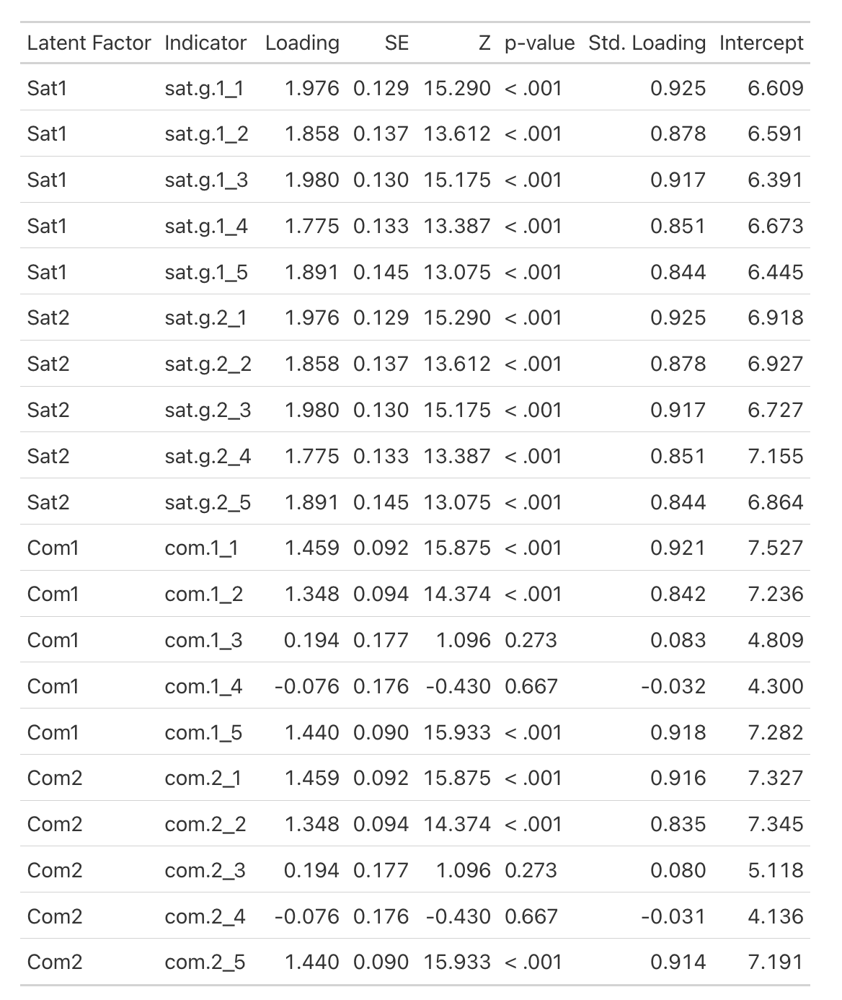
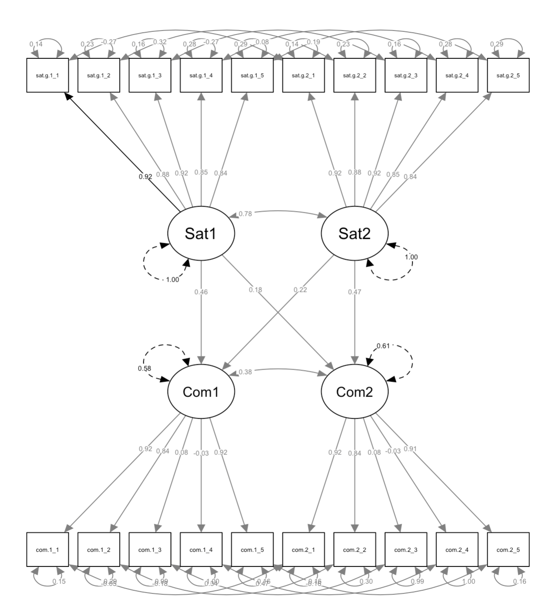
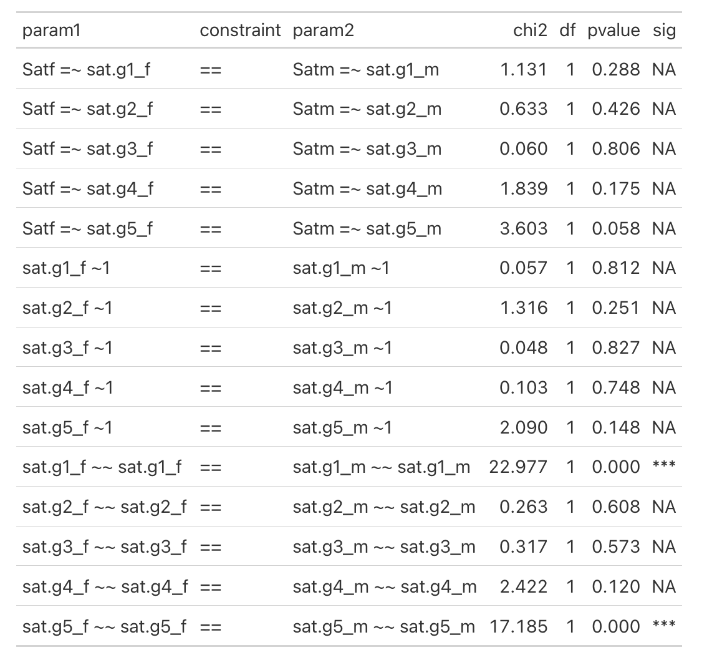

# Summary

`dySEM` is an *R* package [@rcoreteamLanguageEnvironmentStatistical2024] that was created to make it easier for users to deploy the widely popular  `lavaan` package [@rosseelLavaanPackageStructural2012] to fit structural equation models (SEMs) using latent variables to data sets with dependent observations [@littleLongitudinalStructuralEquation2013] collected from interdependent dyads (e.g., romantic partners, pairs of friends, parents, a parent and a child, etc.) [@kennyDyadicDataAnalysis2006]. Initially, the package was exclusively designed to facilitate the testing of dyadic invariance [@sakalukDyadicMeasurementInvariance2021a]--the psychometric equivalence of survey responses across members of dyads. However, the package has since been expanded to include functions that streamline the process of specifying, fitting, and reporting on a variety of models for dyadic data that are amenable to specification in SEM with latent variables [e.g., @kimExtendingActorpartnerInterdependence2022a; @sakalukRenewalDyadicStructural2025].

Currently, `dySEM` faciltates the deployment of several kinds of dyadic SEMs, including:

- "uni-construct" dyadic models: models in which both members of the dyad are measured on the same, singular construct (e.g., both partners complete a measure of relationship satisfaction)[@sakalukRenewalDyadicStructural2025; @sakalukIntroducingBifactorDyadic2021];
- "bi-construct" dyadic models: models in which each member of the dyad is measured on two different constructs, with one being used to predict the other (e.g., the popular Actor-Partner Interdependence Model [APIM], and the less popular Common Fate Model [CFM])[@kennyModelsNonIndependenceDyadic1996; @kennyReflectionsActorpartnerInterdependence2018; @kennyDyadicDataAnalysis2006; @kimExtendingActorpartnerInterdependence2022a; @ledermannCommonFateModel2012]
- "multi-construct" dyadic models: models in which each member of the dyad is measured on multiple constructs, such as when both partners are asked to complete a "multidimensional" survey measure (e.g., a measure of relationship quality with subscales for satisfaction, commitment, intimacy, etc.)

# Statement of Need

Models of dyadic data must simultaneously accomplish two analytic goals: 

1. Mitigating the impact of non-independent observations on inference when using data collected from members of dyads (which otherwise would inflate rates of false-positive effects)[@mccoachDealingDependencePart2010]; and
2. Somehow representing the theoretical notion of interdependence or "togetherness" that is central to dyadic research [@kennyModelsNonIndependenceDyadic1996; @rusbultInterdependenceInteractionRelationships2003]

Though infrequently adopted [@ledermannAnalyzingDyadicData2017; @sakalukRenewalDyadicStructural2025], the combination of (a) the SEM framework with (b) the use of latent variables can provide researchers a powerful analytic framework to accomplish both of these goals, while simultaneously mitigating the biasing [@coleManifestVariablePath2014] and Type-I/false-positive boosting impact of measurement error [@westfallStatisticallyControllingConfounding2016a] that is often present in survey data , and which is particularly pronounced under analytic conditions common to dyadic data analysis [@sakalukRenewalDyadicStructural2025].  

But whereas SEM software--like `lavaan` [@rosseelLavaanPackageStructural2012]--can be used to fit dyadic SEMs with latent variables, the process of specifying, fitting, interpreting, and reporting on such models can be arduous and error-prone, particularly for researchers who are new to SEM or to dyadic data analysis. We see these as considerable barriers to adoption of dyadic SEM, and believe that open-source software can help to lower these barriers [@sakalukRenewalDyadicStructural2025].

`dySEM` is available both on GitHub (https://github.com/jsakaluk/dySEM, https://jsakaluk.github.io/dySEM/index.html) and CRAN (https://cran.r-project.org/web/packages/dySEM/index.html), and was created to simplify the process of using dyadic SEM, making it easier for researchers to leverage the power of dyadic SEMs with latent variables in their own work. 
Indeed, `dySEM` can typically take an analytic workflow that would otherwise require dozens--if not hundreds--of lines of syntax to be manually written, and reduce it to but a handful or two of lines of (more readable) syntax.
For example, the `lavaan` script required for a user to fit a fully distinguishable latent APIM (i.e., no dyadic equality constraints made on any portion of the measurement or structural portions of the model; for a more detailed description, see @kimExtendingActorpartnerInterdependence2022a)--for hypothetical dyadic data from couples on relationship satisfaction and commitment--would look something like:

```{.r}

apim.script <- '

#Measurement Model

#Loadings
Sat1=~NA*sat.g.1_1+sat.g.1_2+sat.g.1_3+sat.g.1_4+sat.g.1_5
Sat2=~NA*sat.g.2_1+sat.g.2_2+sat.g.2_3+sat.g.2_4+sat.g.2_5

Com1=~NA*com.1_1+com.1_2+com.1_3+com.1_4+com.1_5
Com2=~NA*com.2_1+com.2_2+com.2_3+com.2_4+com.2_5

#Residual Variances
sat.g.1_1 ~~ sat.g.1_1
sat.g.1_2 ~~ sat.g.1_2
sat.g.1_3 ~~ sat.g.1_3
sat.g.1_4 ~~ sat.g.1_4
sat.g.1_5 ~~ sat.g.1_5

sat.g.2_1 ~~ sat.g.2_1
sat.g.2_2 ~~ sat.g.2_2
sat.g.2_3 ~~ sat.g.2_3
sat.g.2_4 ~~ sat.g.2_4
sat.g.2_5 ~~ sat.g.2_5

com.1_1 ~~ com.1_1
com.1_2 ~~ com.1_2
com.1_3 ~~ com.1_3
com.1_4 ~~ com.1_4
com.1_5 ~~ com.1_5

com.2_1 ~~ com.2_1
com.2_2 ~~ com.2_2
com.2_3 ~~ com.2_3
com.2_4 ~~ com.2_4
com.2_5 ~~ com.2_5

#Residual Covariances
sat.g.1_1 ~~ sat.g.2_1
sat.g.1_2 ~~ sat.g.2_2
sat.g.1_3 ~~ sat.g.2_3
sat.g.1_4 ~~ sat.g.2_4
sat.g.1_5 ~~ sat.g.2_5

com.1_1 ~~ com.2_1
com.1_2 ~~ com.2_2
com.1_3 ~~ com.2_3
com.1_4 ~~ com.2_4
com.1_5 ~~ com.2_5

#Structural Model

#Latent (Co)Variances
Sat1 ~~ 1*Sat1
Sat2 ~~ 1*Sat2
Sat1 ~~ Sat2

Com1 ~~ 1*Com1
Com2 ~~ 1*Com2
Com1 ~~ Com2

#Latent Actor Effects
Com1 ~ a1*Sat1
Com2 ~ a2*Sat2

#Latent Partner Effects
Com1 ~ p1*Sat2
Com2 ~ p2*Sat1
'

```
To generate the very same script with `dySEM`:

```{.r}

scriptAPIM(dvn, lvxname = "Sat", lvyname = "Com", 
                                constr_dy_x_meas = "none", 
                                constr_dy_y_meas = "none",
                                constr_dy_x_struct = "none", 
                                constr_dy_y_struct = "none", 
                                constr_dy_xy_struct = "none")

```
# State of the Field

There are several other *R*-based tools for dyadic data analysis available for free use, owing to a research culture that promotes the generous provision of methodological and analytic support [e.g., @campbellEstimatingActorPartner2002; @ledermannToolboxProgramsRestructure2015; @stasGivingDyadicData2018]. `dySEM`, however, is distinctive in both its scope, licensing (and underlying values), and analytic robustness. A comparison of `dySEM` versus competitor offerings for dyadic SEM with latent variables and observed variable path analysis is available below in \ref{tab-dysem}. At a high level, `dySEM` is distinguished by being fully open-source (i.e., all source code is available to interested users, and can be modified and built upon by others following a GNU General Public License) and supported by a large number of (transparent) unit-tests, while offering convenient functionality for scripting, calculating, and outputting for a large variety of dyadic SEM models (of which, it is further distinguished by offering the greatest amount of support for [and variety of] latent variable models). And when compared to all alternatives, `dySEM` appears to be the only offering for which unit testing for quality-control is extensive (and growing) and made transparent to the user. We therefore immodestly believe `dySEM` is—and will continue to be—among the more competitive software solutions for dyadic SEM.  

: Comparison of dyadic SEM software. []{label="tab-dysem"}

| Software<br><br><br> | Free | OS Code | OS Tests | Active | Scripting | Documentation |
|---------------------------|------|---------|----------|--------|-----------|---------------|
| *dySEM* <br>(*R* Package: GitHub/CRAN) | Yes | Yes | Yes | Yes | 13 distinct uni-, bi-, and multi-construct dyadic SEMs | Extensive |
| “DyadR” Shiny Apps (GUI-Based) |	Yes	| No | No |	Yes | 6 models (only 1 latent) | Extensive|
|srm (*R* Package: GitHub/CRAN)|	Yes |	Yes |	No | No | 1 model (non-latent)|  Minimal|
|lavaan.srm (*R* Package: GitHub)| Yes | Yes | No |	Yes | 1 model (non-latent)| Moderate|
|lavaan (*R* Package: GitHub/CRAN)| Yes |Yes |No |Yes | None| Extensive|
|Proprietary software (MPlus, AMOS, SAS, etc.,)| No	|No | No| Mixed| None| Minimal|

# Software Design

## Design Philosophy

`dySEM` has been designed for users to follow a generalized 4-step workflow:

1. *scrape* variable information from a data frame of dyadic data
2. *script* the dyadic SEM of interest with one of `dySEM`'s "scripter"" functions
3. *fit* the scripted model with `lavaan`
4. Use `dySEM` "outputter" functions to generate reproducible tabular and graphical summaries of the fitted model

By building on `lavaan` [@rosseelLavaanPackageStructural2012], `dySEM` leverages a widely used, open-source SEM package (and its companion packages) with a large and active user base, and which is under ongoing development. `dySEM`'s capacities should therefore be able to grow alongside `lavaan`'s.

With `dySEM`, we strive to promote an inclusive data analytic ecosystem. The added demand and complexity of implementing certain dyadic models or calculating certain "corrections" [@olsenStructuralEquationModeling2006] may be one (among many) causes of the under-representation of certain types of couples in research [@mcgorrayMostlyWhiteHeterosexual2023]. To that end, all scripting functionality in `dySEM` has been designed to default to an "indistinguishable" model (i.e., one amenable to analyzing gender- and sexuality-diverse couples)--the user must deliberately over-ride these defaults, putting the burden of proof on them to defend the choice of a distinguishable model and their distinguishing feature [@kennyDyadicDataAnalysis2006]--and offers helper functionality to navigate additional indices that are requested when fitting such models [@olsenStructuralEquationModeling2006]. 

## Functionality 

`dySEM` requires dyadic data to be available in a data frame that is in "dyad" or "wide" form (i.e., one row per dyad) [@kennyDyadicDataAnalysis2006],
and with variable names that follow a discernible pattern. `dySEM` "scrapes" this information about variables into a list, which serves as a key input of its scripter functions. For more information, see [our tutorial on naming conventions](https://jsakaluk.github.io/dySEM/articles/varnames.html), and documentation for [`scrapeVarCross()`](https://jsakaluk.github.io/dySEM/reference/scrapeVarCross.html).

The largest source of value in `dySEM`'s code-base are its scripters (i.e., functions beginning with the term "script"), which generate character objects of syntax for dyadic SEMs that can be immediately passed to `lavaan` for model fitting, with whatever optionality (e.g., estimator selection, missing data treatment) the user desires. These scripters generally have optionality for: 

- what method of scale-setting one uses (i.e., "fixed factor"/standardized latent variance or "marker variable"/constraining a factor loading to 1)[@littleLongitudinalStructuralEquation2013]
- what kinds of dyadic equality constraints one wants to impose on the measurement and/or structural portions of the model (e.g, for dyadic invariance testing; to facilitate dyadic comparisons of structural parameters)[@sakalukDyadicMeasurementInvariance2021a]
- whether to include `lavaan` syntax to compute "boutique" estimates and tests (e.g., the *k* parameter of dyadic patterns for an APIM) [@kennyDetectingMeasuringTesting2010], and
- whether to write and export .txt file of the generated script (e.g, to post on the Open Science Framework)

Some examples (with varied use of these arguments):

```{.r}

#Example 1: A fully invariant APIM with actor effects constrained 
# across partners, partner effects freely estimated

apim.script <-  scriptAPIM(dvnxy, lvxname = "Sat", lvyname = "Com", 
constr_dy_x_meas = c("loadings", "intercepts", "residuals"),
constr_dy_y_meas = c("loadings", "intercepts", "residuals"),
constr_dy_xy_struct = c("actors"), est_k = TRUE,
scaleset = "FF")

apim.mod <- lavaan::cfa(apim.script, data = commitmentQ)

#Example 2: A correlated dyadic factors model that is 
# "residually invariant" (i.e., constraints on 
# the pattern, loadings, intercepts, and residuals across dyad members,
#but none for the parameters in the structural portion of the model) 
# and which writes ResidualInvariance.txt to working directory

sat.resid.script <- scriptCor(dvn, lvname = "Sat",
                               constr_dy_meas = c("loadings", 
                               "intercepts", 
                               "residuals"),
                               constr_dy_struct = "none",
                               writeTo = ".", 
                               fileName = "ResidualInvariance")

sat.resid.mod <- lavaan::cfa(sat.resid.script, data = commitmentM, 
estimator = "mlr", missing = "ml")

```

`dySEM` also provides assistance with easy, reproducible reporting from these models. Outputter functions (beginning with "output") can be used to:

- generate tables of parameter estimates from either/both the measurement portion and/or structural portion of a model
- generate path diagrams via the `semPlot` package [@epskampSemPlotUnifiedVisualizations2015] for visualizing model structure and parameter estimates
- generate tables of model comparisons (e.g., in dyadic invariance testing)
- generate tables of "boutique" estimates and tests (e.g., Langrange multiplier tests for identifying item/parameter-sources of noninvariance; correlations among latent variables), and
- compute "boutique" values (e.g., alternative metrics of reliability; effect sizes of dyadic noninvariance)

When tables are created, they can be kept in either data frame form (e.g., to supply visualizations), or exported as .rtf, while path diagrams are exported as .png.

For example: 

```{.r}

#Example 1: Export a table of measurement parameter estimates
# named APIM_Measurement_Table, to working directory.
# Table is generated by gt::gt()
outputParamTab(dvnxy, model = "apim", gtTab = TRUE ,
               apim.mod, tabletype = "measurement",
               writeTo = ".", fileName = "APIM_Measurement_Table")

```

: `outputParamTab()`. []{label="fig-measurement"}
{ width=70% }

```{.r}

#Example 2: Export a path diagram named
# APIM Diagram.png to working directory
# named APIM_Measurement_Table, to working directory 
outputParamFig(apim.mod, figtype = "standardized",
               writeTo = ".", fileName = "APIM Diagram")

```

: `outputParamFig()`. []{label="fig-structural"}
{ width=70% }

```{.r}

#Example 3: Generate a table of Langrange Multiplier tests
# for a dyadic invariance model. Do not filter for
# significance, and output as a gt::gt() table.
outputConstraintTab(sat.resids.mod, filterSig = FALSE, gtTab = TRUE)

```

: `outputConstraintTab()`. []{label="fig-invariance"}
{ width=70% }

# Research Impact

Since its initial release on GitHub in 2021, `dySEM` has been accepted to CRAN (where it has been downloaded more than 4,000 times). `dySEM` has been used in published research, both by members of our research team [e.g., @sakalukSamenessDifferencePsychological2021a] and by other teams in the field [e.g., @girmeGreaterAverageLevels2025]. `dySEM` has also featured in workshops we have delivered at conferences for which dyadic data analysis is an emphasis, and dyadic SEM as a framework, more generally, is enjoying a phase of renewed methodological interest [e.g. @joelCredibilityRevolutionRelationship2025; @sakalukRenewalDyadicStructural2025]. 

# AI Usage Disclosure

`dySEM`'s development began in 2019, well before the advent of mainstream AI tools, and the bulk of the package's current design, functionality, and roadmap have been developed without AI assistance. Our development team now uses AI tools (e.g., Copilot autocompletion within RStudio; increasing use of Cursor as an AI-boosted IDE), though primarily to assist with rote and/or repetitious tasks (e.g., to increase testing coverage of various input or output requirements; to increase consistency of documentation across related functions, etc.). A critical mass of new functionality and its more substantive testing remains done "by hand",  and this manuscript was written almost exclusively without AI assistance (save for spotting/resolving an error with the Markdown table formatting). 

# Acknowledgements

We wish to thank Drs. William Chopik, Christopher Chartier, Lorne Campbell, and Brent Donnellan for their facilitating the special issue of Personal Relationships that led to `dySEM`'s creation [@chopikRelationshipScienceCredibility2020]. We are also very appreciative for the late Dr. Deborah Kashy's enthusiasm towards `dySEM`'s creation and functionality.

The development of `dySEM` has been supported by three internal grants from Western University:

- Western Knowledge Mobilization and Research-Creation Grant (2024-2025)
- Western Research Mobilization, Creation, & Innovation Grants for SSHRC-related Research (2023-2024)
- Western Knowledge Mobilization Innovation Grants (2021-2022)

# References
